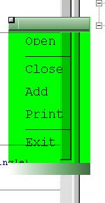



## Menu translucent

### Description

My new form that looks like menu, now updated using translucencies!

Easy to use in your projects, all you need is to modify some things and it&#8217;s ready for use

In your project!

Please vote or leave some comments, telling me what should I make better, and let me now about its bugs!
 
### More Info
 

             |
---                |---
**Submitted On**   |2001-03-03 12:06:00
**By**             |[\[°N €o°\]](https://github.com/Planet-Source-Code/PSCIndex/blob/master/ByAuthor/n-o.md)
**Level**          |Intermediate
**User Rating**    |4.5 (18 globes from 4 users)
**Compatibility**  |VB 5\.0
**Category**       |[Custom Controls/ Forms/  Menus](https://github.com/Planet-Source-Code/PSCIndex/blob/master/ByCategory/custom-controls-forms-menus__1-4.md)
**World**          |[Visual Basic](https://github.com/Planet-Source-Code/PSCIndex/blob/master/ByWorld/visual-basic.md)
**Archive File**   |[CODE\_UPLOAD15752332001\.zip](https://github.com/Planet-Source-Code/n-o-menu-translucent__1-21484/archive/master.zip)

